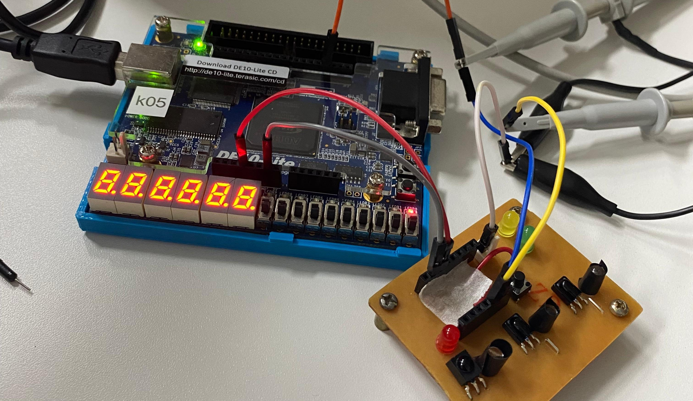
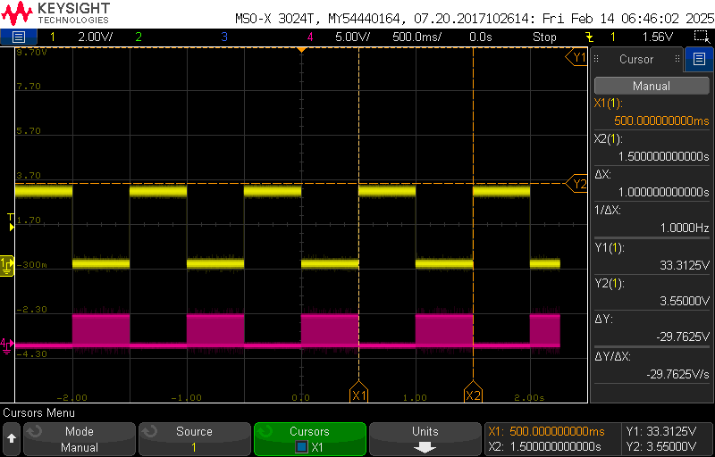

<table align="center"><tr><td align="center" width="9999"><br>


# Implementação e simulação de um sistema de detecção de presença baseado em um sensor infravermelho TSSP580

Instituto Federal de Educação, Ciência e Tecnologia de Santa Catarina<br>
Campus Florianópolis<br>
Departamento Acadêmico de Eletrônica<br>
Dispositivo Lógico Programáveis</b>

*Jonathan Chrysostomo Cabral Bonette*<br>*Matheus Rodrigues Cunha*

#

A utilização de sensores infravermelhos (IR) em aplicações de presença e segurança tem se tornado cada vez mais comum dada sua capacidade de detectar objetos com alta sensibilidade e rapidez, mesmo em ambientes com baixa luminosidade, esses sensores são utilizados em diversas aplicações, como sistemas de alarme, controle de iluminação, detectores de movimento em segurança e interfaces interativas.

Porém em sistemas reais, os sensores IR frequentemente enfrentam desafios decorrentes de ruídos ambientais e interferências de luz ambiente, o que pode comprometer a precisão da detecção. Para reduzir esses problemas, técnicas de modulação e filtragem digital são essenciais. A modulação – no caso deste projeto, a geração de uma portadora de 38 kHz – permite que o sensor seja sensível somente aos sinais modulados, rejeitando grande parte das interferências. Além disso, a implementação de um filtro digital baseado em contagem assegura que somente sinais persistentes (indicativos de uma detecção verdadeira) sejam processados, descartando os ruídos que talvez podem ocorrer durante o burst.

O projeto tem como objetivo implementar e simular um sistema de detecção de presença utilizando o sensor infravermelho TSSP580, utilizando um FPGA DE10-Lite para gerar um sinal de modulação (burst) que aciona um LED emissor, estimulando o sensor IR, assim a resposta do sensor é então processada por um filtro que confirma uma detecção real e assim eliminando os falsos disparos causados por ruídos.

</table>

## Introdução

O projeto tem como objetivo a **implementação e simulação de um sistema de detecção de presença baseado em um sensor infravermelho TSSP580**. Vai ser utilizado um FPGA DE10-Lite para gerar um sinal de modulação (burst) de aproximadamente 38 kHz, que aciona um LED emissor, conforme mostra a documentação oficial. Esse sinal modulado é então utilizado para estimular um sensor IR através de um LED, na qual a resposta é processada por um filtro digital baseado em contagem no qual elimina ruídos transitórios e garante uma confiabilidade maior na detecção do sensor.<br>

Em resumo o desenvolvimento foi dividido em pequenas implementações, cada parte com seu objetivo específico:<br>

### Etapas do Projeto:

**Etapa 1 – Simulação do Módulo LED:** <br>
Implementação da lógica para gerar o sinal modulado (burst) com uma portadora de 38 kHz.

- Desenvolvimento do módulo [led_tx.vhd](vscode/led_tx.vhd).<br>
- Simulação com o testbench [tb_led_tx.vhd](vscode/tb_led_tx.vhd).
- Execução do script [tb_led_tx.do](vscode/tb_led_tx.do).
- **todo: adicionar foto do burst**

**Etapa 2 – Síntese do LED no FPGA e Testes de Bancada:** <br>
Implementação do arquivo top-level para a síntese e implementação do sistema no FPGA DE10-Lite. Integra os módulos do LED, sensor e filtro, e mapeia os sinais para os pinos físicos.

- Compilação e síntese do projeto no Quartus [de10_lite.vhd](quartus/de10_lite.vhd).
- **todo: adicionar foto do quartus**
- Montagem física do sensor e do LED no FPGA DE10-Lite.
<p align="center">
  
</p>
- Verificação do sinal via osciloscópio.
<p align="center">
  
</p>

**Etapa 3 – Simulação do Sensor e dos Ruídos:** <br>
Implementação dos testbenchs para simular a resposta do sensor IR ao sinal de burst e simular ruídos no sinal do sensor, permitindo a avaliação do comportamento em condições adversas.

Desenvolvimento dos testbenches [tb_sensor.vhd](vscode/tb_sensor.vhd) e [tb_noise.vhd](vscode/tb_noise.vhd) para simular a resposta do sensor ao burst e aos ruídos e execução dos scripts [tb_noise.vhd](vscode/tb_noise.do) e [tb_noise.vhd](vscode/tb_noise.do). 
- **todo: adicionar foto da resposta ao led**
- **todo: adicionar foto do noise**

**Etapa 4 – Implementação do Filtro Digital:** <br>
Implementação do filtro digital baseado em contagem tem por objetivo eliminar os ruídos do sensor.

- Desenvolvimento do módulo [filter.vhd](vscode/filter.do) com a lógica de filtro por contagem.
- Simulação com o testbench [tb_filter.vhd](vscode/tb_filter.vhd).
- Execução do script [tb_filter.do](vscode/tb_filter.do).
- - **todo: adicionar foto do filtro**

Este repositório contém todos os arquivos de código, scripts de simulação e documentação do projeto, proporcionando uma visão completa desde a simulação em ambiente de desenvolvimento (VSCode/ModelSim/Quartus) até a implementação real em hardware.<br>


#


#

#

#


**- Modelsim Simulation:**<br>
	

**- Optical Test:**<br>
	

```code ref: test code: optical_test_signal.vhd```

**Cronograma:**<br>
<br>1- Fazer a simulação no vscode do led
<br>1.1- led_tx.vhd
<br>1.2- tb_led_tx.vhd
<br>1.3- tb_led_tx.do

Primeiramente implementamos módulo led_tx.vhd para gerar uma portadora de 38 kHz e controlar o burst do LED, permitindo que o sinal seja transmitido.
O código led_tx.vhd gera um sinal infravermelho modulado a 38 kHz, ativando e desativando o LED IR em períodos específicos. Ele funciona com dois contadores: o primeiro gera a portadora de 38 kHz alternando o sinal a cada 13 ciclos, garantindo a frequência correta. O segundo contador controla a modulação do sinal.
Na próxima figura visualizamos a simulação no ModelSim.


<br>2- Simulação da resposta do sensor

**Cronograma:**<br>
<br>1- Fazer a simulação no vscode do sensor
<br>1.1- tb_sensor.vhd
<br>1.2- tb_Sensor.do

O arquivo tb_sensor.vhd é um testbench usado para simular o comportamento do módulo led_tx. Ele gera um clock de 1 MHz e aplica estímulos ao 
circuito para verificar seu funcionamento. O sinal led_out representa a saída do transmissor de LED IR, que gera pulsos modulados em 38 kHz 
durante o burst.


<br>2.1- compilar
<br>2.2- montagem do sensor físico
<br>2.3- verificação no osciloscópio

Verificação do Funcionamente(Imagem retirada do osciloscópio)


Verificação do Funcionamento(Ruído visto no teste prático)


<br>3- fazer a simulação no vscode do sensor
<br>3.1- fazer uma simulação do sinal do sensor (led ja feito, ou seja, a resposta)
<br>3.2- fazer uma simulação simulando o ruído do sensor

O código cria um sinal de clock de 1 MHz, um reset inicial e gera uma sequência de ruídos na entrada do 
sensor para verificar sua funcionalidade. O processo sensor_process gera sinais com ruído, alternando entre 0 e 1 por pequenos períodos.


<br>4- Implementar um filtro para remover rídos

**Cronograma:**<br>
<br>1- Fazer a simulação no vscode do filtro
<br>1.1- filter.vhd
<br>1.2- tb_filter.vhd
<br>1.3- tb_filter.do

O módulo filter.vhd implementa um filtro digital para remover ruídos na entrada do sensor. Foi utilizado um contador para verificar se o sinal de entrada se mantém estável por um número mínimo de ciclos antes de atualizar a saída filtrada. Foi definido um THRESHOLD para ver quantos ciclos consecutivos o sinal deve permanecer alterado antes de ser validado como uma nova leitura. 
Se o sensor mudar de estado rapidamente por um tempo inferior ao definido, a saída permanecerá inalterada, reduzindo a influência de ruídos. O contador é sensível à borda de subida do clock.


<br>5- organizar o git
<br>5.1- renomear arquivos
<br>5.2- organizar folders

<br>6- documentação
<br>6.1- documentar os códigos
<br>6.2- criar documentação estrutural do projeto
<br>6.3- criar estrutura de folders para ser commitado no repositório da disciplina

**files org**:<br>
<br>```tb_led_tx.do``` : relacionado ao led, criando o burst de 38khz
<br>```tb_led_tx.vhd``` : testbench simulando o comportamento do burst em menor escala
<br>```led_tx.vhd``` : arquivo principal referente a implementação do burst

---

<br>```tb_sensor.do``` : relacionado ao sensor, criando a resposta ao burst, ou seja, o sensor de presença
<br>```tb_sensor.vhd``` : testbench simulando o comportamento do sensor em resposta ao burst em menor escala

---

<br>```tb_noise.do``` : relacionado ao ruído
<br>```tb_noise.vhd``` : testbench simulando ruídos durante a simulação em menor escala

---

<br>```tb_filter.do``` : relacionado ao filtro, removendo o ruído apresentado durante a simulação
<br>```tb_filter.vhd``` : testbench simulando o comportamento do filtro removendo ou tratando os ruídos
<br>```filter.vhd``` : arquivo principal referente a implementação do filtro por contagem
