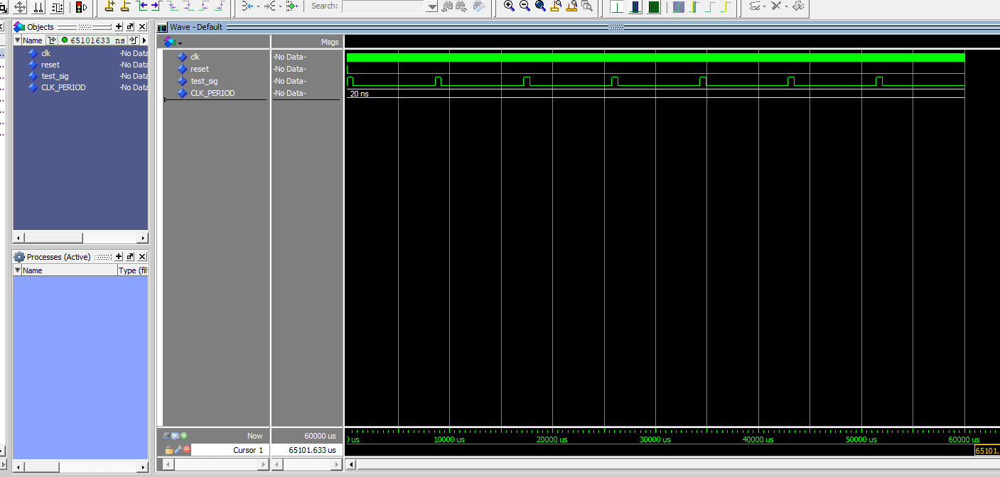
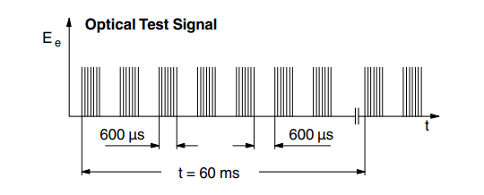

# dlp-tssp580-fpga

**- Modelsim Simulation:**<br>
	

**- Optical Test:**<br>
	

```code ref: test code: optical_test_signal.vhd```

**Cronograma:**
1- fazer a simulação no vscode do led
1.1- main.vhd
1.2- tb_main.vhd
1.3- do.do

2- fazer a síntese no quartus do led e ver a resposta do sensor
2.1- compilar
2.2- montagem do sensor físico
2.3- verificação no osciloscópio da resposta do sensor led -> sensor

3- fazer a simulação no vscode do sensor
3.1- fazer uma simulação do sinal do sensor (led ja feito, ou seja, a resposta)
3.2- fazer uma simulação simulando o ruído do sensor

4- implementar um filtro na implementação
4.1- testar no osciloscópio (opcional)

5- organizar o git
5.1- renomear arquivos
5.2- organizar folders

6- documentação
6.1- documentar os códigos
6.2- criar documentação estrutural do projeto
6.3- criar estrutura de folders para ser commitado no repositório da disciplina